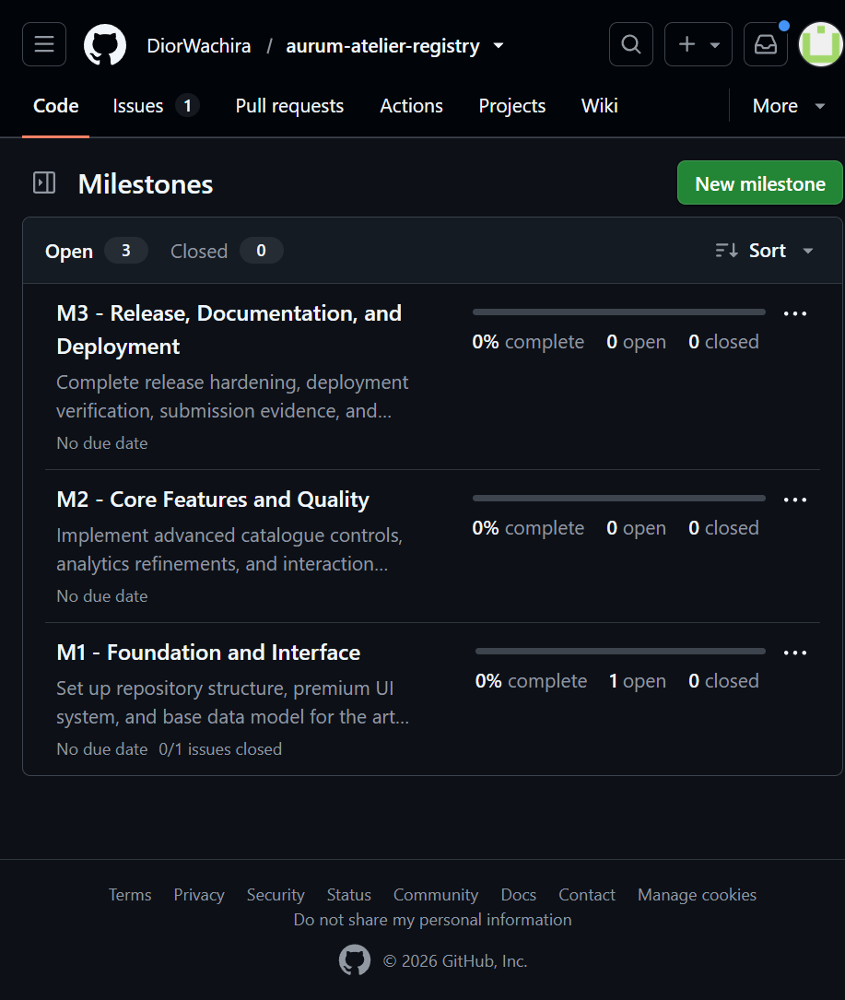
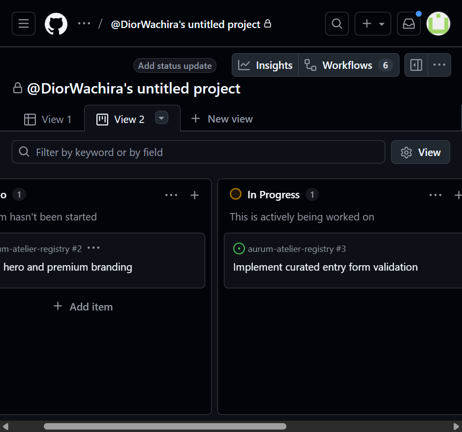
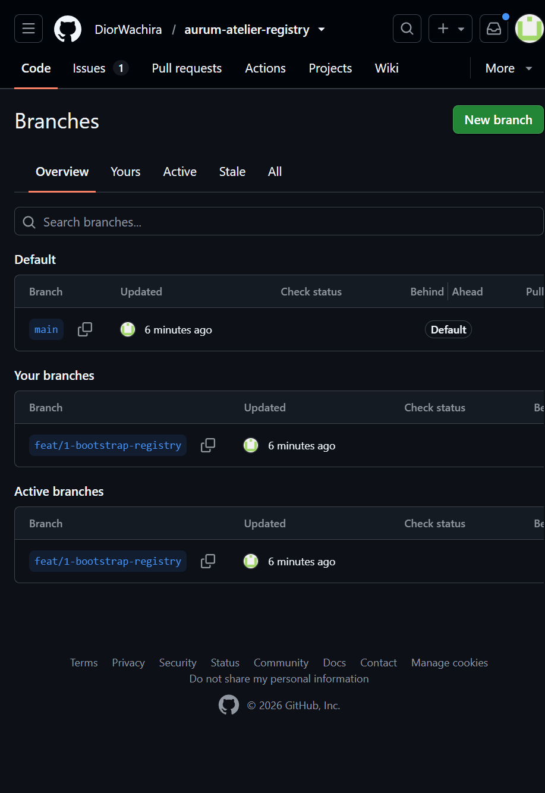
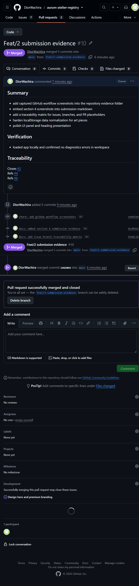
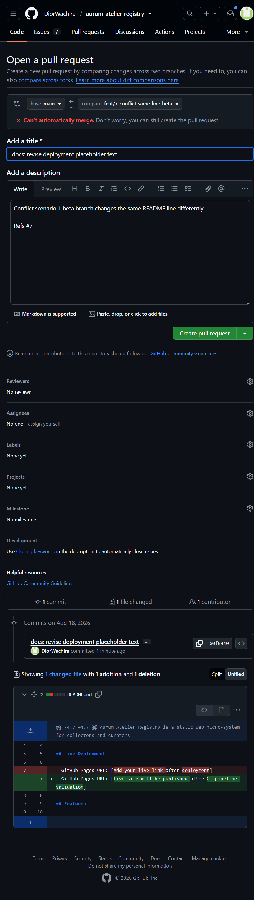
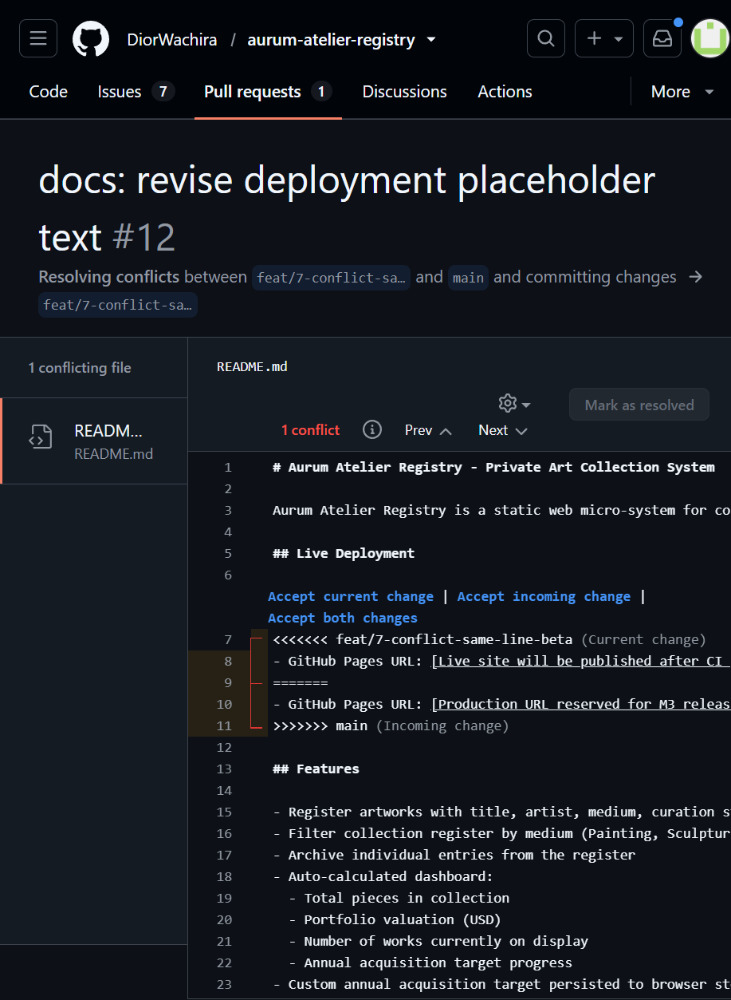
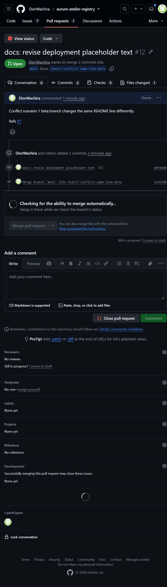
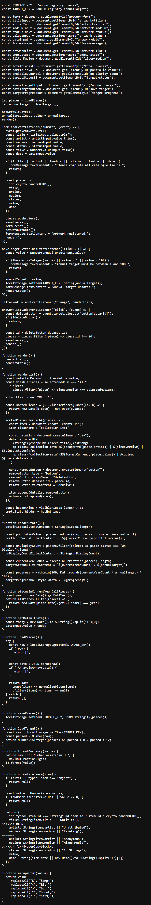
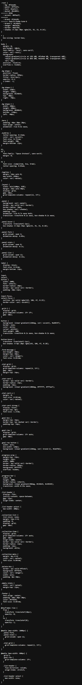

# Project Submission Report

## 1. Student Details

- Full Name: Wachira Njoroge
- GitHub Username: DiorWachira
- Email: njoroge.wachira@strathmore.edu

---

## 2. Deployed Project Link

- Live GitHub Pages URL: [Paste your live deployment link here]

---

## 3. Reflection - Grounded in Your Git History

### A. Your Best Commit

- Commit URL: [Paste the full GitHub commit URL here]
- Why this one? [1-2 sentences explaining what makes this commit well-structured]

### B. A Mistake or Struggle

- Link to the evidence: [Paste URL here]
- What happened and how did you recover? [2-3 sentences]

### C. A Pull Request You're Proud Of

- PR URL: [Paste the full GitHub PR URL here]
- What did you check before merging? [1-2 sentences on what you reviewed]

### D. One Thing You Would Do Differently

- What would you change? [1-2 sentences]
- Link to the evidence of the original decision: [Paste URL to the commit, branch, or issue]

---

## 4. Screenshots of Key GitHub Features

### A. Milestones and Issues

- Caption: Repository milestones are configured (M1, M2, M3) and issue tracking has started with issue-to-milestone linkage.

### B. Project Board

- Caption: Kanban board with To Do, In Progress, and Done was created and actively used by moving issues across columns.

### C. Branching Architecture

- Caption: Branch inventory shows `main` and issue-linked feature branch naming with `feat/` convention.

### D. Pull Requests & Traceability

- Caption: Pull request #10 is merged and includes issue-linked traceability in the description.

---

## 5. Merge Conflict Evidence

### Conflict 1 - Full Chronology

What cause did you use? Same-line edit conflict.

#### Step 1: Generating the Clash

- Caption: Branches feat/7-conflict-same-line-alpha and feat/7-conflict-same-line-beta changed the same README deployment line differently, and GitHub reported that it could not automatically merge.

#### Step 2: Inside the Code Editor (Conflict Markers)

- Caption: The conflict markers show competing edits to the same line; I resolved by keeping both deployment notes so release planning and CI readiness are both captured.

#### Step 3: Resolution & Clean Merge

- Caption: PR #12 was resolved and merged cleanly after conflict resolution, confirming the branch integration completed successfully.

### Conflict 2 - Different Cause

What cause did you use? Overlapping block edits during parallel refactoring.

Why does this cause trigger a conflict? Two branches changed the same normalization block in app.js with different fallback values, so Git could not determine a single safe output for that hunk.

- Caption: Branches fix/8-overlap-block-a and fix/8-overlap-block-b conflict in app.js around normalizePiece fallback values.

### Conflict 3 - Different Cause

What cause did you use? Refactor-versus-edit conflict in shared configuration lines.

Why does this cause trigger a conflict? One branch renamed a design token (brand to accent) while another branch edited the original brand token value on the same lines, creating incompatible edits in the same section.

- Caption: Branches feat/9-theme-refactor-a and feat/9-theme-tune-b collide in styles.css at the root token definitions.

---

## 6. Feedback & Evaluation

- [ ] Anonymous Evaluation Form: [Course & Instructor Evaluation](https://forms.gle/YLybnsyXXErKEg3s9)

---

## Final Submission

Submit through: https://forms.gle/KrT4VxtFtkU3wtYu8

Deadline reminder: no late submissions are accepted.
